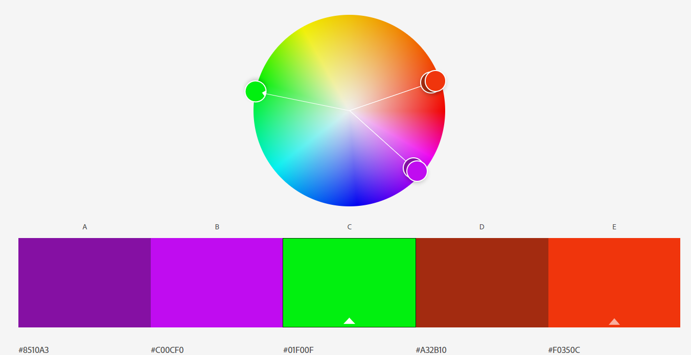

# My Online Resume
The intention of this website is to provide prospective employers and potential collaborators with information about me, my work experience and how to contact me. The site also provides a showcase for my portfolio. 

---

## UX

### User stories
- As a potential employer, I want to be able to see what Elke has done in the past, to help me decide if I want to hire him.
- As a recruiter, I want to be able to see Elke's resume, to determine his marketability to my clients. 
- As someone with a great idea, I want to get a feel for Elke's personality, to determine if I would want to collaborate with him. 

### Strategy
The goal of the UI of this website is to be clear, beautiful and something special. A visitor should feel good when visiting the site to improve the chance of them feeling good toward me, it's creator.

### Scope
In order to be of use to both me and it's users, the site will contain the following pages:
- Home
- Work history
- About me
- Contact

To make it visually interesting there will be a clickable timeline on the work history page.  

### Structure
Being a simplistic site in terms of content, the lay-out will be matching that simplicity. There will be a seperate menu item for each feature. At the bottom there will be an area with links to LinkedIn and Github and an option for downloading my CV. At the home page there will be a testimonials section.

### Skeleton
- Home 
- Work history 
- About me 
- Contact 

### Surface
In terms of look and feel the website will feature nature backgrounds, some with myself in them. These will be set to a fairly high transparancy to not distract from the main content. 
The fonts will be Yeon Sung for the headlines with Song Myung for the main texts, to give a hint of asian affinity. 
The chosen color scheme:

is based on the green nature backgrounds, with good contrasting colors for the menu and text. Only the purple colors will be used to contrast the green. 
All colors, fonts and images are chosen to be somewhat in line with things I am passionate about (Nature/permaculture, Japan) to aid in the "getting to know me" aspect of the website. Added to this is a shade of grey that is also in line with the above. Last there are a shade of teal and blue that contrast well and look esthetically pleasing. 

---

## Features

### Existing features
When viewed on tablet/desktop:
- On the Work History page there is an additional navigation menu on the left hand side. You can click on the dates in this timeline to jump to the appropriate section in the text. 
- When the 'About me' page is loaded, the progressbars will load with an animation. The animation will fill the progressbars to their respective amounts. 
- In the footer there is a link in the bottom left to download my C.V. in a pdf format. 
- In the footer on the bottom right there are links to my social pages.

When viewed on Mobile devices: 
- On the work history page, there is a circular button on the bottom right. When clicked on, this button will open a menu containing all work history names and dates. When clicking on one, you will be taken to the corresponding section in the text.
- When you click on the circular button on the Work History page, the inner teal circle will enlarge when the menu is active. After having clicked somewhere else on the page, this circle will shrink back again. 
- When the Work History page is loaded, an animation is briefly played to draw attention to the circular button on the button right. The animation is that of a teal circle growing and shrinking in size 3 times.

### Features Left to Implement
- A showcase of my portfolio of websites in (for example) a carousel. This could be placed on the home page.
- A showcase of some of my interests. This could be some pictures of garden lay-outs, a showcase of a numbers of books and movies or perhaps some things I love about Japan like the art, nature or language. 

---

## Technologies Used

HTML5 and CSS3 were used as the languages in which this site was made. Additionally the following frameworks/libraries were used:
- [Bootstrap 4.5](https://getbootstrap.com/)
    - The project uses **Bootstrap 4.5** to quickly setup mobile first design, and uses some features as described above in the features section.
- [Font Awesome](https://fontawesome.com/)
    - A few icons are taken to improve the attrativeness of the site

---

## Testing
### Code validators
* Tested for valid HTML code using [W3 validator](https://validator.w3.org/)
    * Home 
    * Work History 
    * About me 
    * Contact 
* Tested for valid CSS code using [W3 CSS validator](https://jigsaw.w3.org/css-validator/) 

### User story tests
- As a potential employer, I want to be able to see what Elke has done in the past, to help me decide if I want to hire him.
    * The "About me" and "what I can do" hyperlinks on the frontpage take you directly to the relevant information. These can also be navigated using the menu at the top of the screen. 
    
- As a recruiter, I want to be able to see Elke's resume, to determine his marketability to my clients. 
    * The "About me" and "what I can do" hyperlinks on the frontpage take you directly to the relevant information. There is also a link in the footer to download a traditional C.V.
    
- As someone with a great idea, I want to get a feel for Elke's personality, to determine if I would want to collaborate with him. 
    * Using the menu at the top of the screen, you can click on the 'About me' page to read about who I am. You can then click on the 'Contact page' which takes you to a form to get in touch. 
    

### Test script
1. Open the website in Chrome developer tools (press F12)
2. Toggle the devices toolbar (press Ctrl + Shift + M)
3. Drag the bar on the side of the website from right to left to change the screen size
    * Verify the site looks as expected on all sizes
4. Click on the bars at the top labeled mobile, tablet and laptop with respective sizes. 
    * Verify the site looks as expected on all sizes
    * Close the developer tools afterwards (press F12 again)
5. Click on the Page titles in the top menu
    * Verify you are taken to the corresponding page every time
6. On the 'Home' page, click on the purple texts 'about me' and 'what I can do'
    * Verify you are taken to the 'About me' and 'Work History' pages.
7. Click on the 'Download a  pdf version of my C.V.' link on the bottom of the page
    * Verify a new tab opens displaying a pdf version of my C.V.
8. Click on the LinkedIn button on the bottom right of the page
    * Verify a new tab opens displaying my LinkedIn page
9. Click on the GitHub button on the bottom right of the page
    * Verify a new tab opens displaying my GitHub page
10. Go to the Work History page using the menu at the top.
11. Click on the titles/dates on the left
    * Verify you are taken to the corresponding text on the right side (main part) of the screen. 
12. While still on the Work History page, open Chrome developer tools again (press F12)
13. Open the devices toolbar (press Ctrl + Shift + M)
14. Set the screen size to mobile by clicking on the middle bar at the top (320px)
15. Click on the round dark grey circle on the bottom right
16. Click on the job titles/dates
    * Verify you are taken to the corresponding parts of text

## Bugs encountered
1. The job text dissapears when you click on an item in the side-navigation. 
    * Fixed by assigning static heights. Explanation for the problem found in [this stackoverflow question](https://stackoverflow.com/questions/16094785/have-a-fixed-position-div-that-needs-to-scroll-if-content-overflows)
2. At the larger screen sizes the columns on the work history page no longer allign.
    * Fixed by removing the number of columns in the class name. This enables it to just fill up the remaining space besides the first column.
3. At mobile screen size, the background overlay does not display all the way down the page (stops after assigned height)
    * Fixed by adding the property overflow: auto and rearranging the order of elements in the css.
4. After deployment to Github pages, the C.V. download link no longer works.
    * The cause of this was Github changing the regular letters to capital letters. Changed code now to match. 
5. After deployment to Github pages, two wireframe links were no longer working. 
    * User error (me), misspelled the name of the files. 
    
---

## Deployment
### Deployment to GitHub pages
When deploying to GitHub pages, I've used the following steps
1. Login to [GitHub](https://github.com)
2. Browse to the [repository](https://github.com/ElkeJohannes/online-resume)
3. Click on the Settings tab
4. Scroll down to the GitHub pages section
5. Click the Select a branch button and select Master
6. Click Save

### Fork this repository
1. Login to [GitHub](https://github.com)
2. Browse to the [repository](https://github.com/ElkeJohannes/online-resume)
3. On the top right of the page, there should be a button that says 'Fork'. Click on this button to fork a copy of the site to your own repositories. 

### Local deployment
To deploy this website locally or on another hosted webserver, all that is needed is a working webserver. Provided you have that, proceed with the steps below.
1. Go to the [GitHub repository](https://github.com/ElkeJohannes/online-resume)
2. Click on the green button that says Code
3. Click the bottom option to download the ZIP
4. Unpack the zip file on your webserver in the folder where you want to run it from

*The starting page is meant to be index.html. If your webserver is not configured to start with this page by default, you will need to configure it to do so. 

Alternatively you can clone this repository by using the GitHub cli. Should you wish to do so, use this command: gh repo clone ElkeJohannes/online-resume

---

## Credits

### Content
* All text is written by myself

### Media
* Testimonial images taken from [Unsplash](www.unsplash.com)
    * Man1 from [shipnorth](https://unsplash.com/@shipnorth)
    * Man2 from [rodreis](https://unsplash.com/@rodreis)
    * Woman1 from [matfelipe](https://unsplash.com/@matfelipe)
* Background image is a photo taken by myself

### Acknowledgements
- Tips and links provided by my mentor: Nishant Kumar (used links provided below)
- Inspiration for a good README file taken from the [Code Institute example README project](https://github.com/Code-Institute-Solutions/StudentExampleProjectGradeFive)
- Looked for inspiration on design ideas on [Colleinfogeek](https://collegeinfogeek.com/personal-website-examples/)